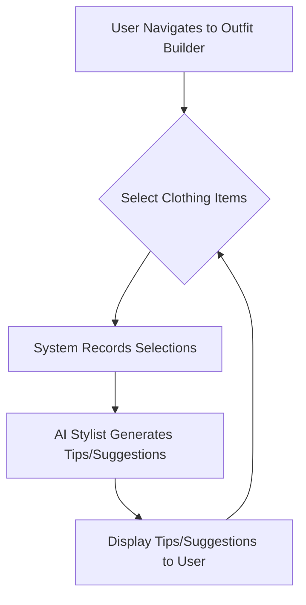

## 1. Product Overview
This feature aims to enhance the user's styling experience by providing interactive outfit suggestions. It solves the problem of decision fatigue when choosing clothes and helps users discover new styling options based on their selected items. The target users are individuals interested in fashion and seeking personalized styling advice.

## 2. Core Features

### 2.1 User Roles
| Role | Registration Method | Core Permissions |
|------|---------------------|------------------|
| Normal User | Email registration | Browse clothes, select items, receive styling tips |

### 2.2 Feature Module
1.  **Item Selection Interface**: Display clickable clothing items.
2.  **Styling Tip Generation**: Logic to generate tips based on selected items.
3.  **Tip Display**: Interface to show the generated styling tips/suggestions.

### 2.3 Page Details
| Page Name | Module Name | Feature description |
|-----------|-------------|---------------------|
| Wardrobe/Outfit Builder Page | Item Selection | Users can browse and select various clothing items (e.g., shirts, pants, shoes, accessories). Selected items are highlighted. |
| Wardrobe/Outfit Builder Page | Styling Suggestions | Based on selected items, the system provides tips like "Pair this shirt with these pants" or suggests complementary items like "You have a shirt and shoes, consider adding shorts or pants." |

## 3. Core Process
The user navigates to the outfit builder page. They click on different clothing items to select them. As items are selected, the system processes these selections. An AI stylist then generates relevant tips or suggestions for completing an outfit or offering alternative pairings. These suggestions are displayed dynamically on the page.

## 4. User Interface Design
### 4.1 Design Style
-   Primary and secondary colors: Cohesive with the existing `clothes` application's theme.
-   Button style: Modern, slightly rounded buttons with clear hover states.
-   Font and sizes: Consistent with existing `Plus Jakarta Sans` and `Cormorant Garamond` fonts.
-   Layout style: Clean, intuitive layout with a clear distinction between item selection area and suggestion display area. Card-based display for individual clothing items.
-   Icon/emoji style suggestions: Simple, minimalist icons for selection indicators.

### 4.2 Page Design Overview
| Page Name | Module Name | UI Elements |
|-----------|-------------|-------------|
| Wardrobe/Outfit Builder Page | Item Selection | Grid of clothing item cards. Each card shows an image, item name, and a selectable overlay/checkbox. Selected items are visually distinguished (e.g., border, background change). |
| Wardrobe/Outfit Builder Page | Styling Suggestions | A dedicated section, possibly a sidebar or a modal, displaying text-based tips and suggested item images. |

### 4.3 Responsiveness
Desktop-first, mobile-adaptive, touch optimization for easy selection on various devices.
