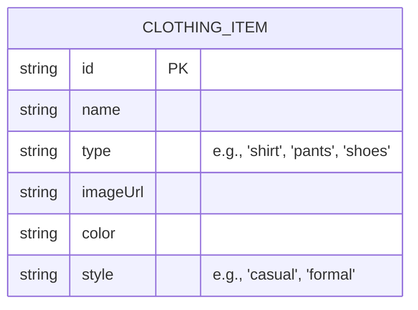

## 1. Architecture Design
```mermaid
graph TD
    A[Frontend: React Application] --> B[Styling Logic/AI Module];
    B --> C[Data Storage/API (for clothing items)];
    A -- Displays --> C;
```

## 2. Technology Description
-   Frontend: React@18 + tailwindcss@3 + vite (assuming this is the existing stack based on the provided `index.css` import and common modern React setups).
-   Initialization Tool: vite-init
-   Styling Logic/AI Module: This could be implemented client-side for simpler rule-based suggestions or server-side (e.g., Python Flask/Node.js Express with a small ML model or extensive rule engine) for more complex, context-aware tips. For initial implementation, client-side rule-based logic is preferred for faster iteration.

## 3. Route Definitions
| Route | Purpose |
|-------|---------|
| /outfit-builder | Page for selecting items and getting styling tips |

## 4. API Definitions (if backend exists)
If a backend is introduced for more advanced AI styling:
-   `POST /api/style-suggestions`:
    -   Request: `{ "selectedItems": ["item_id_1", "item_id_2"] }`
    -   Response: `{ "tips": ["tip 1", "tip 2"], "suggestedItems": ["item_id_3"] }`

## 5. Server Architecture Diagram (if backend exists)
Not applicable for the initial client-side implementation.

## 6. Data Model (if applicable)
### 6.1 Data Model Definition


### 6.2 Data Definition Language
This would depend on the chosen data storage. For a simple client-side approach, this could be a JSON array of clothing items.
